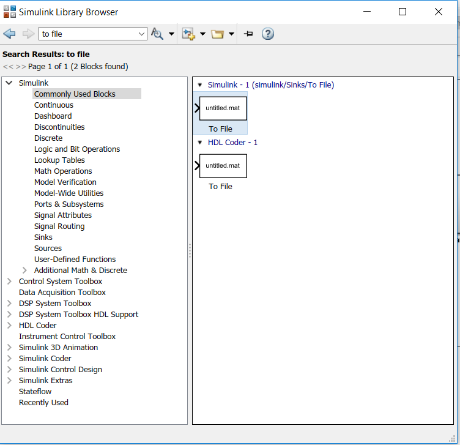
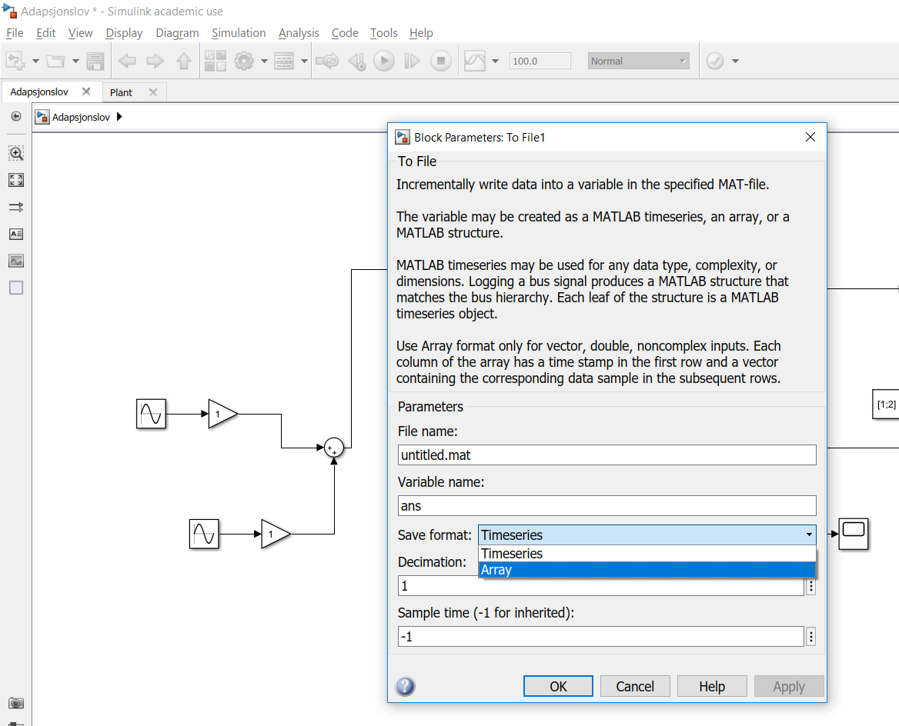

# Linsys_TTK4115
A basic guide tht will (Hopefully) make it easier to use plots in Matlab

## Running the guide
Open guide.m in the top folder
1. Run the entire script first (Or just run the init-section)
2. Find a plot that has something you need
3. The section corresponding to  (ctrl+f) to find the section ( It has the same name as the title of the plot)
4. To only run one section hit (ctrl+enter)
    * The current section is marked in yellow  your corsor is above it 
    * The Plots can be run independently, as long as the init-part has been run

### Misc. Matlab-tips
* close all
    * Closes all plots
* sim('simulink_filename')
    * Runs a simulink-simulation. The filename is without the .slx - ending 
    *  Does not build anything
* Use a to file-block to get data from a simulink-simulation to a .mat -file   
     
    * Remember to change the output-type to array
     
* load('filename') 
    * Get the variable(s) from the .mat file to the workspace (filename is without .mat)
    * The first row of the matrix is time, the rest are in order of input.

### Not implemented:
* Titles in Plots with multiple subplots
* Rotating the y-label and changing its position
* Adding LaTex-code to the labels and legends

